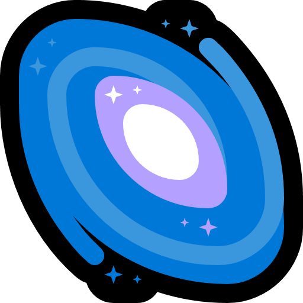

#  Zen Station  

Zen Station is a multipurpose web app designed to give you a virtual environment to help you **focus, study, relax, or just chill**.  
It combines calming background videos of various themes with various widgets like **Pomodoro timer** and **Todo list**, creating a perfect space.  

### 🔗 Live Link: [https://zenstation.netlify.app](https://zenstation.netlify.app)

## ✨ Features  
- 🎥 **Background Player** – Play fullscreen ambient videos for a relaxing atmosphere  
- 🎨 **Various Themes** - Lofi, Cafe, Library, Relax themes
- 🎨 **Create your Theme** - Select any youtube video and custom background
- ⏱️ **Pomodoro Timer** – Stay productive with focus & break cycles  
- 📝 **To-Do List** – Organize your tasks and track progress  
- 🌙 **Minimal, Modern UI** – A glassy, distraction-free interface  

## 🚀 Tech Stack  
- **React JS** and **Vite JS**
- **HTML**  
- **CSS** (with glassmorphism styles)  
- **YouTube IFrame Player API**  

## 💡 Future Improvements  
- 🎶 Playlists links support
- 🎶 Spotify links support
- 📊 Task statistics
- ✨ Ability to set as your new tab page or home page 
- ✨ Add or show inspirational quotes 
